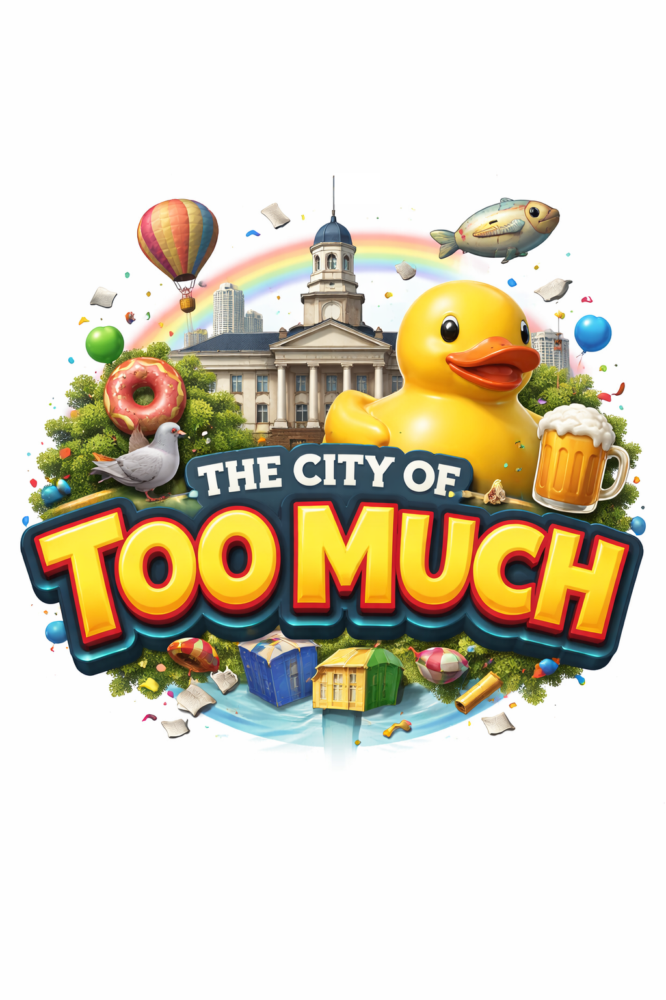

# The City of Too Much

**The City of Too Much** is a semantic balancing game about managing the evolution of a living city caught between rigid order and joyful absurdity. Each decision you make reshapes the world—not through simple point systems, but through meaning. Themes accumulate, contradictions interact, and repeated patterns begin to influence the tone and structure of reality itself.

The city is not a static backdrop. It continuously evolves from your choices. As cards are played, the world visually transforms: architecture shifts, atmosphere changes, details multiply or simplify. Excessive order turns the city sterile and lifeless; unchecked absurdity dissolves coherence. Your role is to keep the city alive in the narrow middle—where tension exists, but meaning still holds.

There is no fixed storyline, no predefined ending, and no single “correct” interpretation of events. Instead, the game is about maintaining a world that can continue. Stability does not mean uniformity, and chaos does not mean creativity. The challenge lies in sustaining a state where contradictions coexist without collapse.

---

## Coherent-World-Continuation

At the core of *The City of Too Much* lies the theory of **Coherent-World-Continuation (CWC)**.

CWC proposes that a world remains viable not because it reaches equilibrium, but because it preserves the conditions necessary for meaningful continuation. A coherent world must avoid two extremes:

* **Over-determination** — when everything becomes fully explained, fixed, and rigid.
* **Disintegration** — when contradictions accumulate beyond interpretability.

In this game, every action is evaluated through this lens. The system does not simply track numerical balance; it assesses how each new element interacts with the existing semantic structure. The city evolves as a consequence of accumulated meaning, not abstract scoring.

The objective is therefore not to “win” by maximizing a value, but to sustain a world capable of continuing—one that remains interpretable, dynamic, and alive.

---

## Implementation Constraints

- Repository-facing implementation artifacts must remain in English.
- World-specific content (setting flavor, card texts, and related narrative strings) must be loaded from a replaceable world-pack file rather than hardcoded.

## License

This project is licensed under the GNU Affero General Public License v3.0 (AGPL-3.0).
Commercial use requires a separate license.

All contributions are subject to the Contributor License Agreement (CLA).

